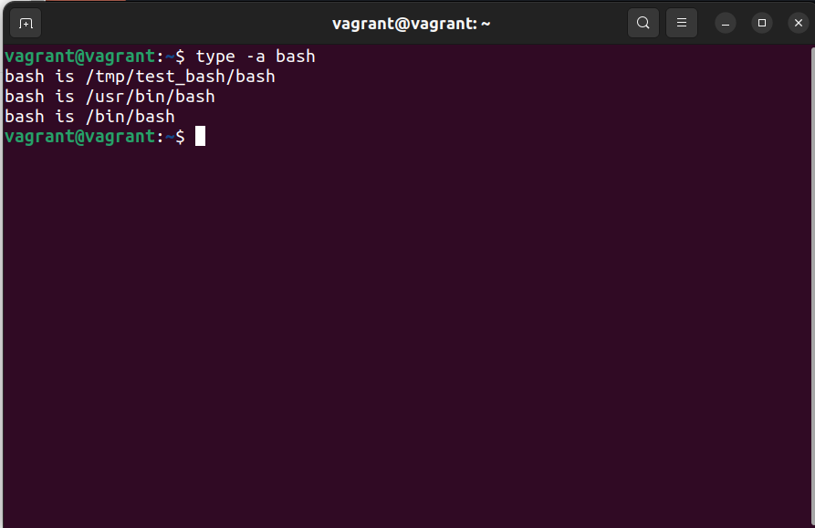

Задание:
1. С помощью базового файла конфигурации запустите Ubuntu 20.04 в VirtualBox посредством Vagrant:

      Создайте директорию, в которой будут храниться конфигурационные файлы Vagrant. В ней выполните vagrant           init. Замените содержимое Vagrantfile по умолчанию следующим:

    Vagrant.configure("2") do |config|
      config.vm.box = "bento/ubuntu-20.04"
    end
   Выполнение в этой директории vagrant up установит провайдер VirtualBox для Vagrant, скачает необходимый образ     и запустит виртуальную машину.

   vagrant suspend выключит виртуальную машину с сохранением её состояния — т. е. при следующем vagrant up будут     запущены все процессы внутри, которые работали на момент вызова suspend, vagrant halt выключит виртуальную        машину штатным образом.

2. Изучите графический интерфейс VirtualBox, посмотрите, как выглядит виртуальная машина, которую создал для вас Vagrant, какие аппаратные ресурсы она выделила. Определите, какие ресурсы выделены по умолчанию.

3. Познакомьтесь с возможностями конфигурации VirtualBox через Vagrantfile: документация. Изучите, как добавить оперативную память или ресурсы процессора виртуальной машине.

4. Команда vagrant ssh из директории, в которой содержится Vagrantfile, позволит вам оказаться внутри виртуальной машины без дополнительных настроек. Попрактикуйтесь в выполнении обсуждаемых команд в терминале Ubuntu.

5. Изучите разделы man bash, почитайте о настройках самого bash:

   какой переменной можно задать длину журнала history, и на какой строчке manual это описывается?
   что делает директива ignoreboth в bash?
   
6. В каких сценариях использования применимы скобки {}, на какой строчке man bash это описано?

7. С учётом ответа на предыдущий вопрос подумайте, как создать однократным вызовом touch 100 000 файлов. Получится ли аналогичным образом создать 300 000 файлов? Если нет, то объясните, почему.

8. В man bash поищите по /\[\[. Что делает конструкция [[ -d /tmp ]]?

9. Сделайте так, чтобы в выводе команды type -a bash первым стояла запись с нестандартным путём, например, bash is... Используйте знания о просмотре существующих и создании новых переменных окружения, обратите внимание на переменную окружения PATH.

   bash is /tmp/new_path_directory/bash
   bash is /usr/local/bin/bash
   bash is /bin/bash
   Другие строки могут отличаться содержимым и порядком. В качестве ответа приведите команды, которые позволили   вам добиться указанного вывода, или соответствующие скриншоты.

10. Чем отличается планирование команд с помощью batch и at?

11. Завершите работу виртуальной машины, чтобы не расходовать ресурсы компьютера или батарею ноутбука.

==============================================
Решение:

1. Установил VB и Vagrant, выполнил команду 'vagrant ini', 'vagrant up', проверил работу команд 'vagrant suspend' и 'vagrant halt'.

2. Из аппаратных ресурсов для виртуальной машины выделено 2 ядра и 1024МБ оперативной памяти. По умолчанию выделена оперативная память (что прописано в Vagrantfile).
3. Изучил документацию, добавить оперативную память и ремурсы процессора можно через Vagrantfile в разделе "config.vm.provider "virtualbox" do |v|".
4. Подключился через команду 'vagrant ssh'.

5. Длину журнала history можно задать переменными HISTSIZE и HISTFILESIZE (строка 1142).
   Директива ignoreboth применяется к переменной HISTCONTROL и позволяет не записывать в историю команду которая начинается с пробела, либо команду, которая дублирует предыдущую.
6. Используется в RESERVED WORDS когда select содержит then until while (строка 193).
7. Чтобы однократным вызовом создать 100000 файлов нужно выполнить команду touch {1..100000}.txt. Однако не получится сделать также с 300000 из-за ограничения лимита "Argument list too long".
8. Конструкция [[ -d /tmp]] возвращает 0 или 1 в зависимости от выражения внутри ( В данном случае возвращает Истину, т. к. выражение внутри проверяет существует директория  /tmp ) Сама конструкция является улучшеной конструкией тест []
9. Сделайте так, чтобы в выводе команды type -a bash первым стояла запись с нестандартным путём.

10.  at - Используется для назначения одноразового задания на заданное время;
     batch - Используется для назначения одноразовых задач, которые должны выполняться, когда загрузка системы        становится 0,8 (0,5).
